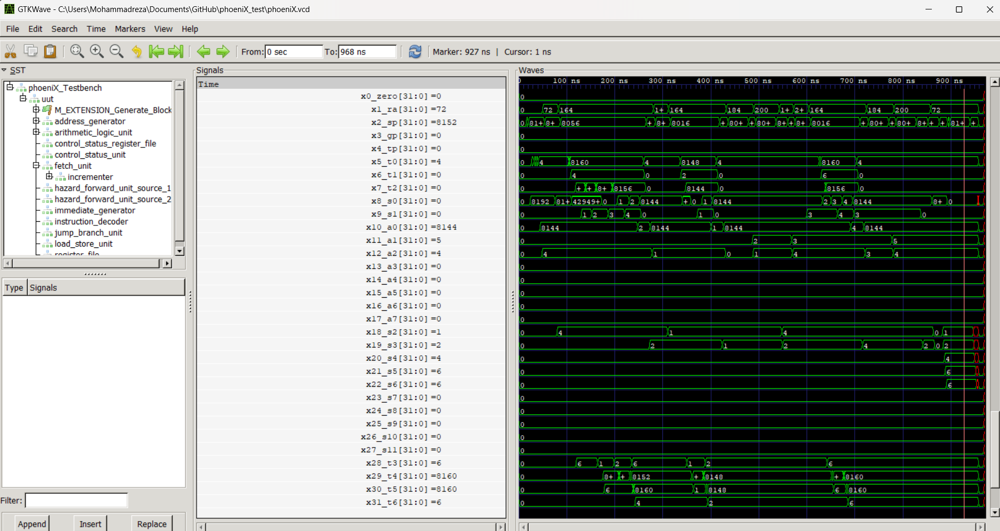
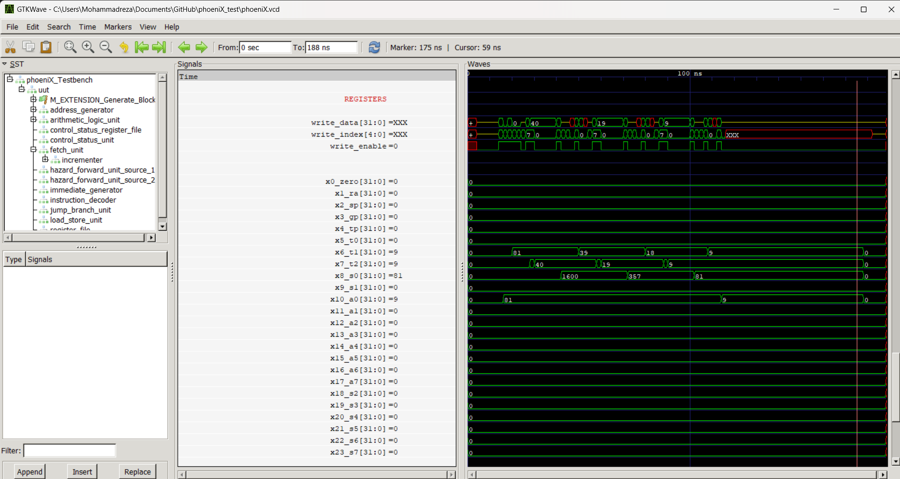

Computer Organization - Spring 2024
==============================================================
## Iran Univeristy of Science and Technology
## Assignment 1: Assembly code execution on phoeniX RISC-V core

- Name:Mohammadreza Validokht Asl
- Team Members:Mohammadreza Nazari
- Student ID: 400414111
- Date:05/24/2024

## Report
## Quick sort
### Introduction to Quicksort

Quicksort is one of the most efficient and widely used sorting algorithms, known for its ability to sort large datasets quickly and with minimal memory usage. It follows the divide-and-conquer paradigm, making it a recursive algorithm that splits the problem into smaller subproblems until they are manageable.

.gif>)

#### How Quicksort Works

1. **Divide**: The array is divided into two subarrays around a pivot element. The pivot is chosen from the array, and the elements are rearranged so that all elements less than the pivot are on its left, and all elements greater than the pivot are on its right. This process is called partitioning.

2. **Conquer**: Quicksort is then recursively applied to the left and right subarrays.

3. **Combine**: Since the subarrays are sorted in place, no work is needed to combine them; the array is sorted when the base cases are reached.

#### Steps of the Algorithm

1. **Choosing a Pivot**: The pivot can be any element of the array. Common strategies include picking the first element, the last element, the middle element, or a random element. The choice of pivot can affect the algorithm's performance.

2. **Partitioning the Array**: Rearrange the array elements so that elements less than the pivot come before it, and elements greater than the pivot come after it. The pivot ends up in its final sorted position.

3. **Recursively Sorting the Subarrays**: Apply the same process to the subarrays formed by splitting at the pivot.

#### Example

Consider sorting the array `[3, 6, 8, 10, 1, 2, 1]` using quicksort:

1. Choose a pivot (e.g., `10`).
2. Partition the array around the pivot: `[3, 6, 8, 1, 2, 1, 10]`.
3. Recursively apply quicksort to the subarrays `[3, 6, 8, 1, 2, 1]` and `[]` (right subarray is empty).
4. Further partition `[3, 6, 8, 1, 2, 1]` around a new pivot (e.g., `6`): `[3, 1, 2, 1, 6, 8]`.
5. Continue the process until all subarrays are sorted.

#### Advantages of Quicksort

- **Efficiency**: On average, quicksort performs O(n log n) comparisons to sort an array of n elements, making it highly efficient for large datasets.
- **In-place Sorting**: Quicksort requires only a small, constant amount of additional storage space, as it sorts the array in place.
- **Flexibility**: It can be easily adapted to different types of data and various pivot selection strategies.

#### Disadvantages of Quicksort

- **Worst-case Performance**: In the worst case (e.g., when the smallest or largest element is always chosen as the pivot), quicksort can degrade to O(n²) time complexity. This can be mitigated by using strategies like random pivot selection or the median-of-three rule.
- **Not Stable**: Quicksort is not a stable sort, meaning it does not necessarily preserve the relative order of equal elements. This can be important for certain applications.

#### Conclusion

Quicksort is a powerful sorting algorithm with a good balance of performance and memory usage. It is particularly well-suited for large datasets and is widely used in practical applications. Understanding its mechanism, including pivot selection and partitioning, is key to leveraging its efficiency. Despite its potential worst-case performance, with appropriate optimizations, quicksort remains a go-to sorting algorithm in many scenarios.

### Code Overview

This assembly code implements the quicksort algorithm to sort an array of integers. Here's a breakdown of the code:

#### `_start` Section:
- **Initialization**: It sets up the stack pointer (`sp`) to allocate a larger stack space and initializes necessary registers.
- **Array Initialization**: Initializes an array `arr` with values `[6, 6, 1, 2, 4]`.
- **Function Call**: Sets up arguments for the `quicksort` function and calls it.
- **Finalization**: After sorting, the sorted elements are loaded back into registers, registers are restored, and stack space is deallocated before ending the program.

#### `quicksort` Function:
- **Prologue**: Allocates space on the stack to save necessary registers and the return address.
- **Base Case Check**: Checks if the low index is greater than or equal to the high index, indicating the base case.
- **Partitioning Call**: Calls the `partition` function to partition the array around a pivot element.
- **Recursive Calls**: Recursively calls `quicksort` for the left and right subarrays.
- **Epilogue**: Restores registers and deallocates stack space before returning.

#### `partition` Function:
- **Prologue**: Allocates space on the stack to save necessary registers and the return address.
- **Pivot Selection**: Selects the pivot element as the last element of the array.
- **Partitioning**: Partitions the array such that elements less than the pivot are on the left, and elements greater than the pivot are on the right.
- **Loop and Swap**: Iterates through the array, swapping elements to partition them around the pivot.
- **Epilogue**: Restores registers and deallocates stack space before returning the pivot index.

#### General Notes:
- **Memory Layout**: The array elements and other variables are stored in memory with appropriate offsets.
- **Register Usage**: Various registers (`s0-s7`, `t0-t6`, `a0-a2`, `ra`) are used for storing values, addressing memory, and managing function calls.
- **Control Flow**: The program flow includes function calls, loops, and conditional branching to implement the quicksort algorithm effectively.
- **Stack Usage**: Stack space is allocated and deallocated as needed for function calls and local variables.

This code efficiently implements the quicksort algorithm in assembly language, leveraging memory management and register usage for sorting an array of integers.

## Integer Square Root
### Introduction to Integer Square Root
Integer Square Root, often abbreviated as ISR, is a mathematical operation that determines the largest integer less than or equal to the square root of a given non-negative integer. Unlike the standard square root operation, which can yield fractional or decimal results, the Integer Square Root produces a whole number result.

### Purpose:
The primary purpose of Integer Square Root is to find an integer value that, when squared, is less than or equal to the given input. It's commonly used in programming and computational tasks where integer operations are preferred or required, such as in algorithms, cryptography, and number theory.

### Algorithm:
There are several algorithms to compute the Integer Square Root. One commonly used method is the binary search algorithm, also known as the "guess and check" method. This algorithm iteratively narrows down the possible range of square roots by halving the search space until the square of the midpoint matches or is less than the input number.

Another approach is Newton's method, which iteratively refines an initial guess until convergence to the exact square root or an approximation within a desired tolerance.

### Properties:
- **Output**: The output of the Integer Square Root operation is always an integer.
- **Accuracy**: It provides the largest integer value whose square is less than or equal to the given input.
- **Efficiency**: The computational complexity of Integer Square Root algorithms varies, but efficient implementations can often achieve fast execution times, especially for large inputs.

### Applications:
- **Performance Optimization**: Integer Square Root can be used to optimize performance in algorithms or computations requiring integer operations.
- **Cryptography**: In certain cryptographic algorithms, Integer Square Root operations are used to generate or manipulate large integers.
- **Resource-Constrained Systems**: In embedded systems or platforms with limited resources, Integer Square Root can be preferred over floating-point operations for efficiency.

### Conclusion:
Integer Square Root is a fundamental mathematical operation with various applications in computer science, mathematics, and engineering. Its ability to efficiently compute integer square roots makes it a valuable tool in algorithm design, numerical computation, and optimization. Understanding Integer Square Root and its implementations can enhance the efficiency and accuracy of various computational tasks.
Sure, here's an overview of the provided code:

### Purpose:
The purpose of this code is to find the integer square root of a given non-negative integer using a binary search algorithm.

### Algorithm:
The code implements a binary search algorithm to efficiently find the integer square root of the input number. It starts with the entire range of possible square roots (from 0 to the input number) and progressively narrows down the search space until it finds the largest integer whose square is less than or equal to the input number.

### Overview of the Code:
1. **Initialization**: 
   - The input number (81) is loaded into register x10 (a0).
   - Registers x5, x6, x7, and x8 are initialized for binary search.

2. **Binary Search**:
   - The binary search is performed iteratively until the low bound (x5) exceeds the high bound (x6).
   - In each iteration:
     - The middle point (mid) is calculated as the average of the low and high bounds.
     - The square of the middle point (mid * mid) is compared with the input number.
     - Based on the comparison, the search space is narrowed down:
       - If mid * mid < input number, the search moves to the upper half of the range.
       - If mid * mid > input number, the search moves to the lower half of the range.
       - If mid * mid equals the input number, the search terminates, and mid is the integer square root.

3. **Termination**:
   - Once the binary search concludes, the integer square root (result) is stored in register x10.
   - The program ends with an ebreak instruction, which typically signals the end of the program execution and may trigger a breakpoint for debugging purposes.

### Conclusion:
This code efficiently calculates the integer square root of a given number using a binary search algorithm. By iteratively halving the search space, it quickly converges to the largest integer whose square is less than or equal to the input number, providing an optimal solution for this mathematical operation.
